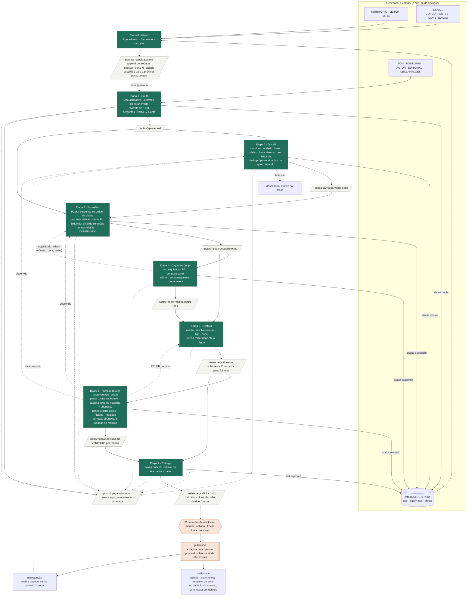

# O fluxo, em um diagrama

O que cada etapa lê, o que escreve, o status que muda no `CLUSTER.md`, e as
voltas previstas. A autoridade continua sendo cada arquivo em `etapas/`;
isto é o mapa para ver tudo de uma vez.

Legenda: retângulo verde é etapa; caixa clara é arquivo em disco; seta
cheia é o caminho normal; seta tracejada é volta prevista. As oito etapas
escrevem no diário; a linha tracejada de todas para ele foi deixada uma
só para o desenho não virar teia. O que muda o status no `CLUSTER.md`
está na seta: 1, 2, 3, 4, 6 e 7; a etapa 5 não muda status, e
`publicado` é o dono.
